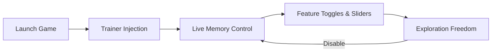

## Light No Fire Trainer — When the World Listens Back

A continent stretches beyond the horizon. Mountains breathe cloud. Firelight trembles in the wind.
In **Light No Fire**, the world is not a backdrop — it is a living thing, vast and indifferent.

This **Light No Fire Trainer** is not here to conquer that world.
It is here to **negotiate** with it.

A precision-built PC tool that gives you adjustable control over survival systems, traversal, and experimentation — without tearing the fabric of immersion.

---

## 🌌 Overview — A Trainer for a World Without Edges

Light No Fire is designed to be endless. This trainer respects that philosophy.

Rather than forcing blunt god modes, it provides **fine-grained authority** over systems that shape exploration and survival. Every feature can be tuned, paused, or withdrawn — moment by moment.

* External Windows-based trainer
* Real-time value editing (no file replacement)
* Session-only memory handling
* Designed for exploration, testing, and creative play

This is not about skipping the journey.
It is about **choosing its tempo**.

---

## 🧭 Exploration & Movement Controls

The land is enormous. Your legs should not be the limit.

* **Unlimited Stamina** – Run, climb, glide without collapse
* **Movement Speed Slider** – Walk like a pilgrim or move like the wind
* **Jump Height Control** – Scale cliffs and ruins with intention
* **Fall Damage Toggle** – Exploration without punishment
* **Swim & Glide Boosts** – Traverse oceans and skies smoothly 🌊

Perfect for cartographers, explorers, and those who want to *see* the world — not wrestle it.

---

## 🔥 Survival & Player Systems

Survival should feel deliberate — not tedious.

* **God Mode (Optional)** – Observe danger without consequence
* **Health & Energy Freeze** – Maintain balance during long expeditions
* **Hunger / Thirst Control** – Focus on discovery instead of micromanagement
* **Temperature Resistance** – Ignore extreme climates when mapping biomes
* **Status Effect Toggle** – Disable burns, poison, or fatigue selectively

You decide which rules matter today.

---

## 🎒 Inventory & Crafting Assistance

Crafting should support creativity, not delay it.

* **Item Quantity Lock** – Prevent resource depletion
* **Instant Crafting** – Remove artificial time barriers
* **Weight / Encumbrance Disable** – Carry what exploration demands
* **Resource Multiplier** – Gather more without breaking balance
* **Quick Build Mode** – Prototype settlements and structures 🏗️

Ideal for builders, testers, and long-form world designers.

---

## 🧠 AI & World Interaction Tools

Sometimes, the world needs to pause so it can be understood.

* **Enemy Damage Control** – Reduce or nullify incoming threats
* **Creature Freeze** – Study behavior or capture screenshots
* **Aggro Range Adjustment** – Explore hostile zones peacefully
* **Time Scale Control** – Slow sunsets… or accelerate storms
* **Weather Influence** – Observe environments without interruption ☁️

For artists, researchers, and storytellers — this is invaluable.

---

## ⚙️ Setup — Lighting the First Spark

The ritual is simple.

1. Launch **Light No Fire** normally
2. Load into your world or character
3. Run the **Trainer** as Administrator
4. Wait for the “Game Detected” confirmation
5. Toggle features via hotkeys or the trainer panel

Example default bindings:

```text
F1  - God Mode
F2  - Unlimited Stamina
F3  - Speed Control
F4  - Inventory Lock
NUM0 - Disable All
```

Profiles can be adjusted per session — nothing permanent, nothing forced.

---

## 🧩 Conceptual Flow — How the Trainer Breathes



Close the trainer, and the world returns to its original rhythm.

---

## ❓ FAQ — Questions Carried on the Wind

**Is this a cheat or a trainer?**
A trainer — external, session-based, and reversible.

**Does it modify game files or saves?**
No. All changes exist only while the trainer is active.

**Can I fine-tune values instead of toggling?**
Yes. Most systems use sliders rather than binary switches.

**Is it safe for exploration builds and testing?**
Yes — especially for creators, builders, and map explorers.

**Does it work with future updates?**
Trainers are typically updated alongside major patches.

---

## 🛑 A Gentle Warning

> [!WARNING]
> Endless worlds demand restraint.
> Use power to explore — not to erase meaning.

---

## 🌄 Final Thoughts — When the Fire Burns Steady

The world of **Light No Fire** is too large to rush, too alive to trivialize.
This trainer does not shorten the journey — it **removes friction**, letting wonder breathe.

Climb higher. Walk farther. Pause the storm.
Let the fire burn — on your terms.

---
